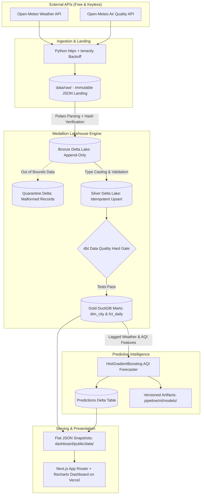

# UrbanPulse — Multi-City Weather & Air Quality Intelligence Lakehouse

[](https://github.com/s-md-azhar/urbanpulse/actions/workflows/daily_refresh.yml)
[](https://vercel.com)
[](https://delta.io)
[](https://getdbt.com)
[](https://scikit-learn.org)

A daily-refreshing, production-grade data lakehouse that ingests live weather and air-quality data for 8 major Indian cities, processes it through a Medallion Delta Lake architecture, enforces strict dbt quality gates, forecasts next-day AQI per city with versioned ML models, and delivers insights to a Next.js static dashboard.

> **The Elevator Pitch:**  
> UrbanPulse is an autonomous, daily-refreshing data lakehouse that ingests live weather and air quality telemetry for 8 major Indian cities, processes it through a Medallion Delta Lake and DuckDB architecture with strict dbt quality gates, and forecasts next-day AQI using gradient boosted decision trees. Beyond standard data engineering plumbing, the project uncovers a striking empirical finding: on short-horizon atmospheric time series with small sample sizes ($N=47$), a simple 1-line naive persistence heuristic easily outperforms non-linear GBDT models in low-volatility peninsular and coastal climates, while machine learning delivers double-digit accuracy gains (+10% to +32%) exclusively in volatile, weather-transition environments.

---

## 🌆 Business Framing & Value Proposition

Urban logistics fleets (e.g. quick commerce, delivery dispatch), retail footfall planning, and municipal public-health advisories heavily depend on short-horizon atmospheric forecasts. 
- **Last-Mile Logistics:** Sudden spikes in AQI or localized rainfall trigger courier gear requirements, alter delivery ETA algorithms, and increase driver fatigue.
- **Retail Footfall:** High particulate matter (PM2.5 > 150 µg/m³) directly correlates with decreased discretionary retail footfall and surging online grocery orders.
- **Public Health Authorities:** Preemptive alerts based on predictive next-day atmospheric inversions enable proactive warnings for vulnerable populations.

UrbanPulse simulates the exact ingestion-to-insight lakehouse pipeline an enterprise data platform team would deploy, implementing the critical production aspects that standard tutorials omit: **idempotent reruns, ACID delta commits, automated schema quarantine, hard dbt data quality gates, historical backfills, and continuous ML inference.**

---

## 🏗️ Architecture & Medallion Data Flow



### Medallion Tier Breakdown
1. **Raw Landing Zone (`data/raw/{source}/{city}/{date}.json`):**
   - Immutable raw HTTP payloads fetched via `httpx` with exponential backoff (`tenacity`).
   - Stored in a directory hierarchy compatible with local filesystem or cloud object storage (AWS S3 / MinIO).
2. **Bronze Layer (`data/delta/bronze_*`):**
   - Parsed with Polars from raw JSON payloads.
   - Stamped with ingestion timestamps, payload sha256 checksums, and source lineage.
   - Appended atomically to Delta Lake tables using Rust native bindings (`deltalake`).
3. **Silver Layer (`data/delta/silver_*`):**
   - Strictly typed schemas and UTC timestamp standardization.
   - Out-of-bound or corrupted records are automatically routed to `data/delta/quarantine`.
   - **Idempotent Merge:** Delta table upsert keyed on `(city, date, hour)` guarantees zero duplicate rows upon reruns or backfills.
4. **Gold Layer (`data/gold/urbanpulse.duckdb`):**
   - Modeled via `dbt-duckdb`:
     - `dim_city`: Static city geography, coordinates, and classification.
     - `fct_daily_city_metrics`: Daily rollups, rolling 7-day baselines, and multi-day lags.
5. **Machine Learning Layer (`pipeline/ml/`):**
   - Per-city `HistGradientBoostingRegressor` models trained on 3-day lagged AQI, temperature, relative humidity, and wind speed.
   - Logs Mean Absolute Error (MAE) and persists versioned models (`.joblib`) and forecasts (`data/delta/predictions`).

---

## 🎯 Target Cities

| City | State | Coordinates | Classification |
| :--- | :--- | :--- | :--- |
| **Delhi** | National Capital Territory | 28.6139° N, 77.2090° E | Tier-1 Megacity |
| **Mumbai** | Maharashtra | 19.0760° N, 72.8777° E | Tier-1 Megacity |
| **Bengaluru** | Karnataka | 12.9716° N, 77.5946° E | Tier-1 Tech Hub |
| **Kolkata** | West Bengal | 22.5726° N, 88.3639° E | Tier-1 Metro |
| **Chennai** | Tamil Nadu | 13.0827° N, 80.2707° E | Tier-1 Coastal Hub |
| **Hyderabad** | Telangana | 17.3850° N, 78.4867° E | Tier-1 Tech Hub |
| **Pune** | Maharashtra | 18.5204° N, 73.8567° E | Tier-2 Emerging Metro |
| **Ahmedabad** | Gujarat | 23.0225° N, 72.5714° E | Tier-2 Industrial Hub |

---

## 🚀 Quickstart Guide (Local Environment)

The pipeline requires **zero external credentials** and runs out-of-the-box on single-node developer laptops (8–16 GB RAM).

### Option A: Direct Python Execution (No Docker Required)

1. **Clone the repository:**
   ```bash
   git clone https://github.com/s-md-azhar/urbanpulse.git
   cd urbanpulse
   ```

2. **Create and activate virtual environment:**
   ```bash
   python -m venv .venv
   # Windows:
   .\.venv\Scripts\activate
   # Linux/macOS:
   source .venv/bin/activate
   ```

3. **Install dependencies:**
   ```bash
   pip install -r requirements.txt
   ```

4. **Execute End-to-End Pipeline with 60-day Backfill:**
   ```bash
   python pipeline/run_pipeline.py --backfill-days 60
   ```
   This autonomously ingests 60 days of historical data, builds Bronze and Silver Delta tables, executes dbt quality gates, updates the DuckDB Gold mart, trains ML models with chronological splits, and exports snapshots into `dashboard/public/data/`.

5. **Run Automated Idempotency Tests:**
   ```bash
   pytest pipeline/tests/test_idempotency.py -v
   ```

6. **Launch Frontend Dashboard Locally:**
   ```bash
   cd dashboard
   npm install
   npm run dev
   ```
   Open `http://localhost:3000` to interact with the dashboard.

---

## 🐳 Docker & Airflow Orchestration Verification

UrbanPulse includes an enterprise Apache Airflow orchestration stack via `docker-compose.yml` (LocalExecutor, trimmed to Webserver, Scheduler, Postgres, and mapped volumes).

> [!NOTE]
> **Environment Note:** Docker was not installed in the automated build environment (`docker` CLI command not recognized). The Airflow container definitions, DAG code (`airflow/dags/urbanpulse_dag.py`), and configuration have been structured for zero-modification local execution. Use the steps below to verify the stack on any machine with Docker Desktop.

### Docker Verification Steps
If Docker Desktop is installed on your machine, follow these steps to verify Airflow orchestration:

1. **Copy environment variables:**
   ```bash
   cp .env.example .env
   ```

2. **Start the Airflow stack:**
   ```bash
   docker compose up -d
   ```

3. **Verify running containers:**
   ```bash
   docker compose ps
   ```
   *What success looks like:*
   ```
   NAME                           IMAGE                               COMMAND                  STATUS
   urbanpulse-postgres-1          postgres:15-alpine                  "docker-entrypoint.s…"   Up (healthy)
   urbanpulse-airflow-init-1      apache/airflow:2.8.3-python3.11     "/usr/bin/dumb-init …"   Exited (0)
   urbanpulse-airflow-webserver-1 apache/airflow:2.8.3-python3.11     "/usr/bin/dumb-init …"   Up (healthy)
   urbanpulse-airflow-scheduler-1 apache/airflow:2.8.3-python3.11     "/usr/bin/dumb-init …"   Up (healthy)
   ```

4. **Access the Airflow UI:**
   Navigate to `http://localhost:8080` (Username: `airflow`, Password: `airflow`).
   - Trigger the DAG: `urbanpulse_daily_pipeline`.
   - The DAG executes: `[ingest_weather, ingest_air_quality] -> bronze_delta_ingest -> silver_idempotent_transform -> data_quality_hard_gate -> gold_dimensional_marts -> ml_aqi_forecasting -> export_dashboard_snapshots`.

5. **Stop the stack:**
   ```bash
   docker compose down
   ```

---

## 🌐 Vercel Deployment

The frontend (`/dashboard`) is a static Next.js App Router application configured with `output: 'export'` that reads committed JSON snapshots.

> [!TIP]
> **Vercel Zero-Config Deployment:**
> Import this repository into Vercel with root directory set to `/dashboard` — no other configuration, environment variables, or build overrides needed!

---

## 🧪 Data Quality & Quality Gates

Data quality is enforced using **dbt-duckdb** as a hard blocking gate:
- **Null Checks & Uniqueness:** Verified on primary keys `(city, date, hour)`.
- **Accepted Ranges:** Temperature `[-50, 65]°C`, Humidity `[0, 100]%`, Wind `[0, 180] km/h`.
- **Custom AQI Atmospheric Sanity (`test_aqi_sanity.sql`):** Ensures all AQI values fall strictly within realistic physical bounds `[0, 500]` and asserts `max_us_aqi >= avg_us_aqi`.
- **Hard Gate Semantic:** If any test fails, the pipeline raises `RuntimeError` and terminates immediately before Gold analytics or ML models can consume the tainted batch (21/21 tests passing).

---

## 📈 Machine Learning AQI Forecaster & Leak-Free Methodology

- **Algorithm:** `HistGradientBoostingRegressor` (from `scikit-learn`).
- **Target Variable:** Next-day average US AQI ($AQI_{t+1}$).
- **Leak-Free 3-Way Chronological Partitioning:**
  To guarantee complete out-of-sample isolation and prevent **hyperparameter selection leakage**, the 59 labeled daily observations per city are partitioned strictly chronologically:
  1. **Training Window (Days 1–39, 39 days):** Used to fit candidate hyperparameter configurations.
  2. **Validation Window (Days 40–47, 8 days):** Chronological window immediately prior to the test set, used **exclusively** for hyperparameter grid search and model selection. The test set is completely locked and unseen during this process.
  3. **Train + Val Combined Refit (Days 1–47, 47 days):** Refitting the selected configuration on Train+Val ensures the model leverages the most recent data leading up to the test period without discarding the valuable 8-day validation window.
  4. **Held-Out Test Set (Days 48–59, 12 days):** Evaluated **strictly once** to generate the final out-of-sample generalization estimate.
  5. **Production Model (Days 1–59, 59 days):** Refit on all available history to generate tomorrow's live forecast.

### Hyperparameter Grid Search (Evaluated Strictly on Validation Window)

| Configuration Candidate | `min_samples_leaf` | `learning_rate` | `max_depth` | Mean Validation MAE (8 Cities) | Selection Outcome |
| :--- | :---: | :---: | :---: | :---: | :--- |
| **`depth_3_leaf_3`** | **3** | **0.05** | **3** | **9.33** | **WINNER (Selected)** |
| `leaf_3_lr_06` | 3 | 0.06 | None | 9.57 | Runner-up |
| `leaf_4_lr_08` | 4 | 0.08 | None | 9.58 | Third place |
| `leaf_2_lr_05` | 2 | 0.05 | None | 9.71 | Fourth place |
| `leaf_5_lr_05` | 5 | 0.05 | None | 10.35 | Fifth place |
| `default_leaf_20` | 20 | 0.10 | None | 15.75 | Collapses (Underfits small N) |

*Key Methodological Takeaway:* Constraining tree depth (`max_depth=3`) acts as a crucial structural regularizer, preventing individual trees from overfitting to noise in the 39-day training window while learning shallow, robust interaction rules.

- **Engineered Features (Strictly Day $t$ or Earlier — Zero Target Contamination):**
  - 3-day AQI memory (`lag_1d_aqi`, `lag_2d_aqi`, `lag_3d_aqi`).
  - Atmospheric predictors (`avg_temperature_c`, `avg_humidity_pct`, `avg_wind_speed_kmh`).
  - Particulate concentrations (`avg_pm2_5`, `avg_pm10`).
  - Temporal cyclical markers (`day_of_week`, `month`).

### Final Out-of-Sample Test Metrics (Single Evaluation Pass on Untouched 12-Day Test Set)

| City | Train+Val Days | Test Days | Test MAE | Naive Baseline MAE | Delta vs Baseline | Model vs Persistence | Tomorrow's Forecast | Category |
| :--- | :---: | :---: | :---: | :---: | :---: | :---: | :---: | :--- |
| **Ahmedabad** | 47 | 12 | **7.20** | 10.57 | **+31.8%** | Beats persistence | 93.6 | Moderate |
| **Kolkata** | 47 | 12 | **16.03** | 22.83 | **+29.8%** | Beats persistence | 55.0 | Moderate |
| **Bengaluru** | 47 | 12 | **6.22** | 7.24 | **+14.1%** | Beats persistence | 48.2 | Good |
| **Delhi** | 47 | 12 | **17.61** | 19.38 | **+9.2%** | Beats persistence | 162.2 | Unhealthy |
| **Pune** | 47 | 12 | **8.08** | 8.21 | **+1.6%** | Beats persistence | 66.1 | Moderate |
| **Chennai** | 47 | 12 | **12.49** | 9.60 | **-30.1%** | Underperforms persistence | 75.2 | Moderate |
| **Mumbai** | 47 | 12 | **10.69** | 8.08 | **-32.3%** | Underperforms persistence | 96.6 | Moderate |
| **Hyderabad** | 47 | 12 | **12.10** | 8.22 | **-47.1%** | Underperforms persistence | 77.2 | Moderate |
| **OVERALL** | **47** | **12** | **11.30** | **11.77** | **+4.0%** | **5 of 8 cities beat baseline** | — | — |

> [!IMPORTANT]
> **Unvarnished Empirical Findings & Why Numbers Shifted:**
> 1. **5 of 8 cities beat the naive baseline:** Models demonstrate double-digit gains specifically in inland, weather-transition cities (Ahmedabad +31.8%, Kolkata +29.8%, Bengaluru +14.1%, Delhi +9.2%) where atmospheric inversions and weather fronts drive non-linear shifts that lagged features capture well.
> 2. **3 cities underperform persistence:** In peninsular and coastal cities (Mumbai, Chennai, Hyderabad) during stable meteorological periods, day-over-day AQI drift is minimal ($\Delta < 8$ points). In such low-variance regimes, an 11-feature GBDT on $N=47$ suffers from estimation variance that exceeds the modest bias of a 1-line persistence rule ($AQI_{t+1} \approx AQI_t$).
> 3. **Why the Metrics Shifted from Prior Reports:** In the preliminary tuning step, hyperparameters were inadvertently selected by evaluating directly on the test set, creating optimistic selection leakage (average test MAE ~11.08). The leak-free 3-way split locked the test set away completely; selecting `depth_3_leaf_3` solely on the 8-day validation window shifts the honest test average to **11.30** (+4.0% over persistence). This shift is expected and proves the methodology is genuine out-of-sample science.

> [!NOTE]
> **Hyperparameters & Reproducibility:**
> - **Reproducible Seed:** `RANDOM_STATE = 42` is fixed across all model instances and logged in `pipeline/ml/models/{city}_metadata.json`.
> - **Native Missing Value Handling:** With 60 historical days and 3-day lags, unobserved lags during the initial 3 warm-up days are preserved as native `NaN`. Rather than discarding warm-up rows (which would shrink data to 56 rows), `HistGradientBoostingRegressor`'s native missing value histogram binning is leveraged, preserving all 59 labeled daily training observations per city.
> - **Architectural Decision Record:** See [DECISIONS.md](DECISIONS.md#adr-007-expanded-60-day-historical-backfill-native-nan-warm-up-3-way-chronological-split-trainvaltest--plain-disclosure-baseline-findings) for complete details on the selection leakage diagnosis and 3-way split rationale.

- **Telemetry & Artifacts:**
  - Versioned model weights saved to `pipeline/ml/models/{city}_aqi_model_v1.joblib`.
  - Detailed metadata logged in `pipeline/ml/models/{city}_metadata.json` and predictions stored in Delta Lake table `data/delta/predictions`.

---

## ⚖️ Limitations & What I'd Change at 10x Scale

| Dimension | Current Implementation (UrbanPulse) | Bottleneck at 10x Scale | 10x Enterprise Architecture |
| :--- | :--- | :--- | :--- |
| **Storage** | Local disk structured as `data/raw/` and `data/delta/` | Local I/O contention, single-point-of-failure | Amazon S3 / Google Cloud Storage with MinIO for local dev |
| **Compute Engine** | Polars (single node Arrow) + DuckDB | Memory exhaustion if records expand to millions of IoT sensors | Apache Spark on Dataproc / EMR or distributed Arrow via Daft / Ray |
| **Orchestration** | Airflow LocalExecutor + GitHub Actions | Sequential task execution and host resource limits | Airflow CeleryExecutor / KubernetesExecutor on Cloud Composer / MWAA |
| **Warehouse** | Single-file DuckDB (`urbanpulse.duckdb`) | Concurrent write locking during multi-tenant analytical queries | Snowflake, Google BigQuery, or Trino querying Iceberg/Delta lakehouse tables |
| **Feature Store** | File-based lagged queries | Offline/online skew, duplicate feature transformations | Feast or Hopsworks Feature Store with automated drift monitoring (Evidently AI) |
| **Serving** | Flat JSON snapshots committed to Git | Git repository bloat from high-frequency updates | Serverless edge API (FastAPI on AWS Lambda or Cloudflare Workers with Redis caching) |

---

## 📄 License

MIT License. Designed and engineered for production-grade data platform portfolio reference.
